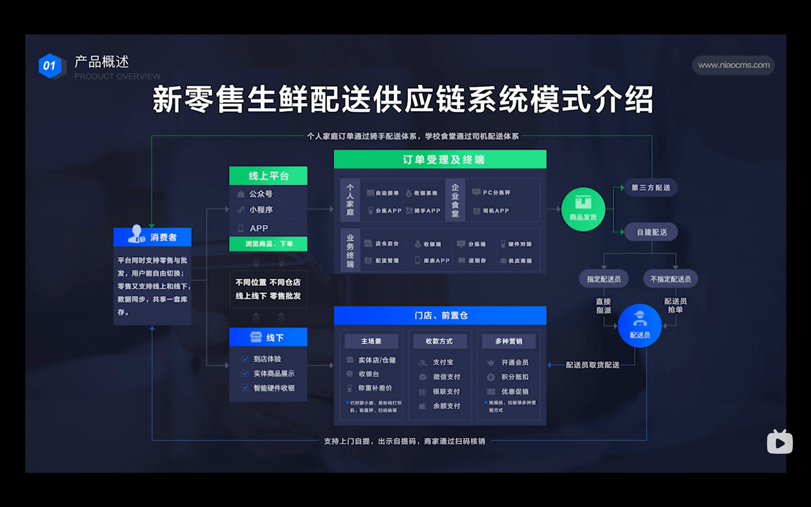
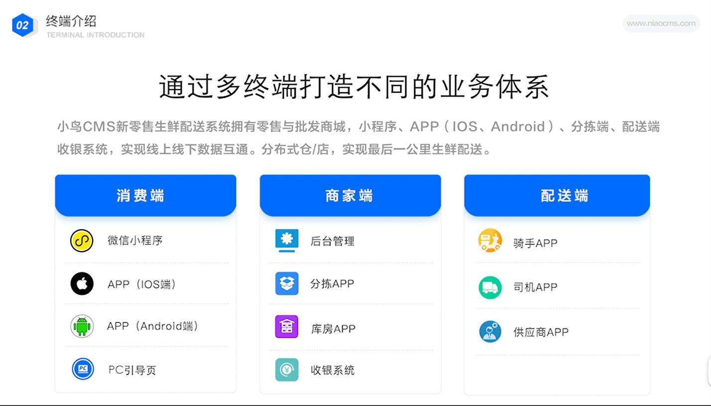
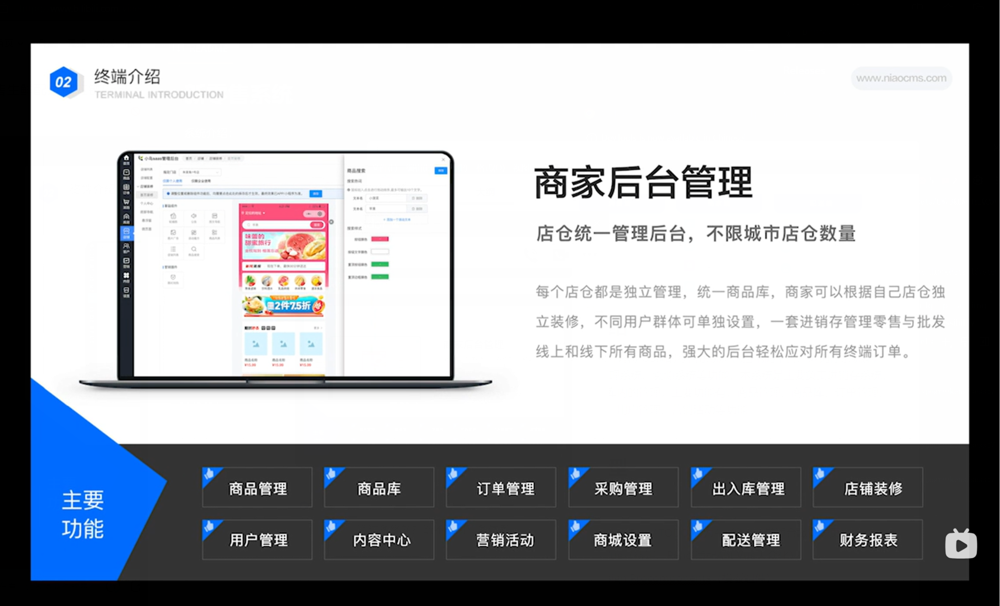

# 新零售系统

系统介绍：

[新零售OSM系统](https://www.bilibili.com/video/BV197411V7dB/?spm_id_from=333.337.search-card.all.click&vd_source=7cbedfe7fba74d1f33ba0be855f9cb79)

[新零售生鲜配送供应链SaaS系统_蔬菜配送软件_农产品配送软件_小鸟CMS](https://www.bilibili.com/video/BV1Y94y117eb/?spm_id_from=333.880.my_history.page.click&vd_source=7cbedfe7fba74d1f33ba0be855f9cb79)

系统架构:

多端操作

## 项目介绍

 本系统是一个基于OSM的零售系统，包括电商平台、进销存系统(仓库)、客户管理系统、溯源系统等功能，本系统是主要负责进销存系统，主要是对仓库内的管理，主要功能有，商品管理、商品库、订单管理、出入库管理、用户管理、营销活动等功能

## 技术选型

### 前端

- Ant Design Pro（TODO 因为Ant的UI非常适合做管理页面）
- React\Vue（待定、React适配Ant Vue大众化）
- Ant Design Procomponents（模板组件）
- Umi（路由）
- Umi Request（Axios的封装）

### 后端

- Spring Boot
- Spring Boot start (做API签名认证)
- Dubbo
- Nacos
- Spring Cloud Alibaba
- Spring Cloud Gateway（网关限流日志）

### 数据库表设计

用户表(员工) Staff

| 列名            | 类型         | 默认值            | 是否为空                         | 是否主键 | 简介                                       |
| --------------- | ------------ | ----------------- | -------------------------------- | -------- | ------------------------------------------ |
| accountID       | bigint       |                   | auto_increment                   | 是       | 员工ID                                     |
| accountName     | varchar(256) |                   |                                  |          | 员工姓名                                   |
| accountMs       | varchar(256) |                   | null                             |          | ms号(用于登录终端)                         |
| accountPassword | varchar(512) |                   |                                  |          | 员工密码                                   |
| gender          | tinyint      |                   | null                             |          | 性别                                       |
| phone           | varchar(128) |                   | null                             |          | 手机号                                     |
| department      | int          |                   |                                  |          | 部门                                       |
| accountStatus   | int          |                   |                                  |          | 状态0-服务中                               |
| accountRole     | int          |                   |                                  |          | 角色(站长、副站、理货(白夜班)、水产、分拣) |
| createTime      | datetime     | CURRENT_TIMESTAMP |                                  |          | 创建时间                                   |
| updateTime      | datetime     | CURRENT_TIMESTAMP | null on update CURRENT_TIMESTAMP |          | 更新时间                                   |
| isDelete        | tinyint      | 0                 |                                  |          | 是否删除(逻辑)                             |

商品表

| 列名              | 类型          | 默认值            | 是否为空 | 是否主键 | 简介            |
| ----------------- | ------------- | ----------------- | -------- | -------- | --------------- |
| skuID             | bigint        | 自增              |          | 是       | 商品ID          |
| productName       | varchar(256)  |                   | null     |          | 商品名称        |
| productBarcode    | varchar(256)  |                   | null     |          | 商品条码        |
| OverdueTime       | datetime      |                   | null     |          | 过期时间        |
| storageDays       | varchar(256)  |                   | null     |          | 存储天数        |
| productCount      | bigint        |                   | null     |          | 数量            |
| productType       | int           |                   | null     |          | 类型(百货 生鲜) |
| productAmount     | DECIMAL       |                   | null     |          | 金额            |
| productStatus     | int           | 0                 |          |          | 状态(上下架)    |
| batchNumber       | varchar(256)  |                   | null     |          | 批次号          |
| producrUrl        | varchar(1024) |                   | null     |          | 商品图片        |
| supplier          | varchar(256)  |                   | null     |          | 供应商          |
| producingArea     | varchar(256)  |                   | null     |          | 产地            |
| storageConditions | int           |                   | null     |          | 存储条件        |
| specifications    | int           |                   | null     |          | 规格            |
| createTime        | datetime      | CURRENT_TIMESTAMP |          |          | 创建时间        |
| updateTime        | datetime      | CURRENT_TIMESTAMP |          |          | 更新时间        |
| isDelete          | tinint        | 0                 |          |          | 是否删除        |

订单表

采购表

